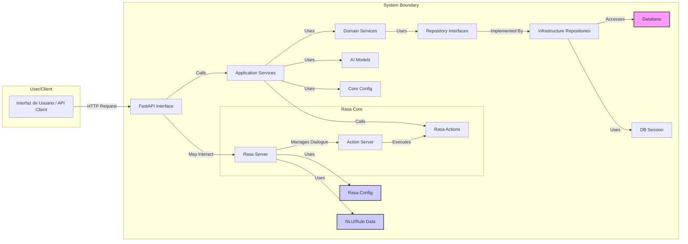

# Chatbot de servicios (restaurante)

Asistente conversacional avanzado basado en Rasa y modelos LLM/IA complementarios, diseñado para responder preguntas del diversos servicios, con capacidad de modificar los datos de entrenamiento y un fácil despliegue. Integra una API RESTful robusta construida con FastAPI para facilitar la interacción con sistemas externos y frontends.

## Tabla de Contenidos

- [Visión General](#visión-general)
- [Arquitectura](#arquitectura)
- [Estructura del Proyecto](#estructura-del-proyecto)
- [Requisitos Previos](#requisitos-previos)
- [Instalación y Configuración](#instalación-y-configuración)
- [Uso y Ejecución](#uso-y-ejecución)
  - [Ejecutar el Chatbot (Rasa)](#ejecutar-el-chatbot-rasa)
  - [Ejecutar la API (FastAPI)](#ejecutar-la-api-fastapi)
- [Entrenamiento de Modelos](#entrenamiento-de-modelos)
- [Configuración Detallada](#configuración-detallada)
- [API Endpoints](#api-endpoints)
- [Base de Datos](#base-de-datos)

## Visión General

Este proyecto implementa un sistema de chatbot de última generación utilizando Rasa para el procesamiento del lenguaje natural (NLU) y la gestión del diálogo. Se potencia con una selección de modelos de IA adicionales (ChatterBot, DeepSeek, Gemma, Gemma2) para ofrecer respuestas más ricas, contextuales o específicas según el caso de uso. La lógica de negocio principal, centrada en [**menciona la funcionalidad, ej: gestión de pedidos**], se maneja a través de acciones personalizadas de Rasa y servicios de dominio, con persistencia de datos gestionada mediante una base de datos relacional. Una API FastAPI expone las funcionalidades clave para su consumo por otras aplicaciones o interfaces de usuario.

**Características Principales:**

- **NLU Robusto:** Comprensión de intenciones y extracción de entidades mediante Rasa.
- **Gestión de Diálogo Flexible:** Combinación de reglas, historias y formularios de Rasa para flujos conversacionales estructurados y dinámicos.
- **Acciones Personalizadas:** Ejecución de lógica de negocio compleja, integración con bases de datos y APIs externas a través de acciones Python en Rasa.
- **Integración Multi-Modelo:** Capacidad para seleccionar y utilizar diferentes modelos de IA (Rasa, ChatterBot, DeepSeek, Gemma, Gemma2) para generar respuestas.
- **API RESTful Moderna:** Interfaz basada en FastAPI para interacciones programáticas, siguiendo los estándares OpenAPI.
- **Arquitectura Limpia:** Diseño por capas (Interfaz, Aplicación, Dominio, Infraestructura) para alta cohesión, bajo acoplamiento y mantenibilidad.
- **Persistencia de Datos:** Almacenamiento y recuperación de datos de [**menciona el dominio, ej: pedidos**] utilizando [**menciona la tecnología si la sabes, ej: SQLAlchemy con PostgreSQL/SQLite**].
- **Configuración Centralizada:** Gestión de configuraciones mediante archivos YAML estándar de Rasa y variables de entorno (`.env`).

## Arquitectura

El sistema se estructura siguiendo principios de diseño por capas para una clara separación de responsabilidades:

1.  **Core Rasa:** Orquesta la conversación, manejando NLU (`data/nlu.yml`), gestión de diálogo (`data/rules.yml`, `domain.yml`), y la invocación de acciones.
2.  **Aplicación (`app/`):** Contiene la implementación específica del sistema:
    - **`interface` (Capa de Presentación/API):** Expone la funcionalidad mediante FastAPI (`api/`). Gestiona las solicitudes HTTP, validación de datos (`schemas.py`), inyección de dependencias (`dependencies.py`), y enrutamiento (`routes/`).
    - **`application` (Capa de Aplicación):** Contiene los casos de uso y la lógica de orquestación. Incluye las acciones personalizadas de Rasa (`actions/`), la lógica para interactuar con los diferentes modelos de IA (`models/`), datos de soporte (`data/content.py`) y posibles scripts de entrenamiento (`training/`).
    - **`domain` (Capa de Dominio):** El corazón del negocio. Define las entidades (`models/order_model.py`), las reglas de negocio (implícitas en los servicios) y las abstracciones para la persistencia (interfaces en `repositories/`). Es independiente de frameworks externos. Los servicios de dominio (`services/`) encapsulan la lógica de negocio.
    - **`infrastructure` (Capa de Infraestructura):** Implementa los detalles técnicos como el acceso a la base de datos (`database/session.py`), clientes HTTP para APIs externas, etc. Implementa las interfaces definidas en la capa de dominio (`repositories/`).
    - **`core` (Núcleo de Aplicación):** Configuraciones globales (`config.py`) compartidas dentro de la aplicación `app`.
3.  **Puntos de Entrada:**
    - `main.py`: Inicia la aplicación FastAPI utilizando un servidor ASGI como Uvicorn.
    - `rasa run` / `rasa run actions`: Comandos estándar de Rasa para ejecutar el servidor principal y el servidor de acciones.
    - `init_db.py`: Script para configurar el esquema inicial de la base de datos.
    - `trainer.py` (Opcional): Script personalizado para orquestar procesos de entrenamiento.
4.  **Configuración y Datos:**
    - `config.yml`, `domain.yml`, `credentials.yml` (implícito): Archivos de configuración de Rasa.
    - `data/`: Datos de entrenamiento (NLU, Reglas, Historias - aunque no hay `stories.yml` listado).
    - `.env`: Variables de entorno para configuración sensible o específica del despliegue.
    - `models/`: Almacén de los artefactos de modelos entrenados (Rasa, etc.).



## Estructura del Proyecto

```
├── .env.example           # Plantilla para variables de entorno
├── .gitignore             # Especificaciones de Git para ignorar archivos/directorios
├── .rasa/                 # Directorio interno de Rasa (caché, logs temporales)
├── app/                   # Código fuente principal de la aplicación Python
│   ├── application/       # Lógica de orquestación y casos de uso
│   │   ├── actions/       # Acciones personalizadas ejecutadas por Rasa
│   │   │   └── order_actions.py # Ejemplo: Acciones relacionadas con pedidos
│   │   ├── data/          # Datos estáticos o contenido utilizado por la aplicación
│   │   │   └── content.py
│   │   ├── models/        # Implementaciones o wrappers para modelos de IA externos
│   │   │   ├── chatterbot.py
│   │   │   ├── deepseek.py
│   │   │   ├── gemma.py
│   │   │   ├── gemma2.py
│   │   │   └── rasa.py    # Posiblemente un wrapper o lógica relacionada con Rasa
│   │   └── training/      # Scripts para entrenar modelos (no Rasa)
│   │       ├── chatter_trainer.py
│   │       └── model_trainer.py
│   ├── core/              # Componentes centrales de la aplicación 'app'
│   │   └── config.py      # Carga y gestión de configuración específica de 'app'
│   ├── domain/            # Lógica de negocio pura y modelos de dominio
│   │   ├── models/        # Modelos de datos del dominio (agnósticos a la DB)
│   │   │   └── order_model.py # Ejemplo: Modelo para la entidad 'Pedido'
│   │   ├── repositories/  # Interfaces para los repositorios (abstracción de datos)
│   │   │   └── order_repository.py # Interfaz para operaciones de datos de Pedido
│   │   └── services/      # Servicios que encapsulan la lógica de negocio del dominio
│   │       └── order_service.py  # Lógica de negocio para Pedidos
│   ├── infrastructure/    # Implementaciones técnicas (acceso a DB, APIs externas)
│   │   └── database/      # Relacionado con la base de datos
│   │       └── session.py   # Gestión de sesiones de base de datos (ej: SQLAlchemy)
│   └── interface/         # Puntos de entrada a la aplicación 'app' (API)
│       └── api/           # Configuración y definición de la API RESTful (FastAPI)
│           ├── dependencies.py # Funciones de dependencia de FastAPI (ej: obtener sesión DB)
│           ├── execute.py      # Script auxiliar o de ejecución (requiere inspección)
│           ├── routes/         # Módulos que definen los endpoints de la API
│           │   └── chat.py     # Rutas para la funcionalidad de chat/conversación
│           └── schemas.py      # Esquemas Pydantic para validación de datos de la API
├── config.yml             # Configuración del pipeline y políticas de Rasa
├── data/                  # Datos de entrenamiento y dominio de Rasa
│   ├── nlu.yml            # Ejemplos de entrenamiento NLU (intents, entities)
│   └── rules.yml          # Reglas para la gestión de diálogo de Rasa
├── domain.yml             # Definición del dominio de Rasa (intents, entities, slots, actions, responses)
├── init_db.py             # Script para la inicialización/migración del esquema de la DB
├── main.py                # Punto de entrada para iniciar la aplicación API con Uvicorn
├── models/                # Directorio para almacenar modelos entrenados
│   └── ... .tar.gz        # Modelo Rasa entrenado
├── requirements.txt       # Lista de dependencias Python del proyecto
├── trainer.py             # Script de entrenamiento (probablemente para Rasa o modelos personalizados)
└── venv/                  # Entorno virtual Python (generalmente no versionado)
```


## Requisitos Previos

- Python (Se recomienda versión 3.8 - 3.10, verificar compatibilidad de Rasa)
- `pip` y `venv` (incluidos generalmente con Python)
- Git
- (Opcional) Acceso a una instancia de base de datos si no se usa SQLite (ej: PostgreSQL).
- (Opcional) Docker y Docker Compose, si el proyecto está contenedorizado.

## Instalación y Configuración

1.  **Clonar Repositorio:**

    ```bash
    git clone https://github.com/nextpassword99/chatbot-restaurant.git
    cd chatbot-restaurant
    ```

2.  **Entorno Virtual:**

    ```bash
    python -m venv venv
    # Windows
    venv\Scripts\activate
    # macOS/Linux
    source venv/bin/activate
    ```

3.  **Instalar Dependencias:**

    ```bash
    pip install -r requirements.txt
    ```

    _(Esto instalará Rasa, FastAPI, Uvicorn, y todas las demás librerías necesarias)_

4.  **Variables de Entorno:**

    - Crea tu archivo `.env` a partir del ejemplo: `cp .env.example .env`
    - Edita `.env` y configura las variables requeridas:
      - `DATABASE_URL`: Cadena de conexión a la base de datos.
      - `SECRET_KEY`: Clave secreta para la aplicación FastAPI (si es necesaria).
      - Credenciales o Endpoints para modelos externos (DeepSeek, Gemma APIs, etc.).
      - Otras configuraciones específicas del entorno.

5.  **Base de Datos:**
    - Asegúrate de que el servidor de base de datos (si no es SQLite) esté en ejecución y accesible.
    - Ejecuta el script de inicialización:
      ```bash
      python init_db.py
      ```

## Uso y Ejecución

Se requieren múltiples terminales para ejecutar todos los componentes simultáneamente durante el desarrollo.

### Ejecutar el Chatbot (Rasa)

1.  **Terminal 1: Servidor de Acciones de Rasa:**

    - Inicia el servidor que escucha las llamadas para ejecutar acciones personalizadas.
    - Navega al directorio raíz del proyecto (donde está `config.yml`).
    - Ejecuta (asegúrate de que el entorno `venv` esté activado):
      ```bash
      rasa run actions
      ```
    - Este servidor debe permanecer en ejecución para que el bot pueda realizar tareas complejas.

2.  **Terminal 2: Interfaz de Chat (Shell) o Servidor Rasa:**
    - **Opción A: Chat en Consola (para pruebas rápidas):**
      ```bash
      rasa shell
      ```
    - **Opción B: Servidor Rasa (si la API FastAPI no se comunica directamente con Rasa):**
      ```bash
      rasa run --enable-api --cors "*" -p 5005
      ```
      (El puerto `-p 5005` es el predeterminado de Rasa).

### Ejecutar la API (FastAPI)

1.  **Terminal 3: Servidor API FastAPI:**
    - Este servidor expondrá los endpoints RESTful.
    - Ejecuta (asegúrate de que el entorno `venv` esté activado):
      ```bash
      uvicorn main:app --reload --host 0.0.0.0 --port 8000
      ```
    - `--reload`: Para desarrollo, reinicia automáticamente al cambiar el código. Quítalo en producción.
    - `--host 0.0.0.0`: Permite conexiones desde fuera de `localhost`.
    - `--port 8000`: Puerto en el que la API estará disponible (`http://localhost:8000`).
    - En `main.py` ya está definido uvicorn en 8002, basta con ejecutar el script.

## Entrenamiento de Modelos

1.  **Entrenamiento del Modelo Rasa:**

    - Modifica los archivos en `data/` (`nlu.yml`, `rules.yml`) y `domain.yml` según sea necesario.
    - Asegúrate de que `config.yml` defina el pipeline y las políticas deseadas.
    - Ejecuta el comando de entrenamiento desde la raíz del proyecto:
      ```bash
      rasa train
      ```
    - Se generará un nuevo modelo comprimido en `models/`. Rasa utilizará automáticamente el último modelo entrenado a menos que se especifique uno diferente.

## Configuración Detallada

- **`.env`:** Variables de entorno. Prioridad sobre configuraciones por defecto. Ideal para secretos (claves API, contraseñas DB) y ajustes específicos del despliegue (URLs, modo debug).
- **`config.yml`:** Define el pipeline NLU (componentes, orden, parámetros) y las políticas de diálogo de Rasa (RulePolicy, MemoizationPolicy, TEDPolicy). Es crucial para el rendimiento y comportamiento de Rasa.
- **`domain.yml`:** Especifica el universo conocido por Rasa: intents, entities, slots (memoria del bot), respuestas predefinidas (`responses`), acciones (incluyendo las personalizadas) y formularios.
- **`credentials.yml` (No listado, pero estándar en Rasa):** Configura la conexión a servicios externos como conectores de mensajería (Slack, Telegram), ASR/TTS, u otros endpoints REST/GraphQL que Rasa necesite contactar.
- **`app/core/config.py`:** Puede utilizar librerías como Pydantic's `BaseSettings` para cargar configuración desde `.env` o archivos, proporcionando un objeto de configuración tipado para la aplicación FastAPI.

## API Endpoints

- `POST /chat`: Endpoint principal para enviar mensajes del usuario y recibir la respuesta del bot.

## Base de Datos

- La configuración de la conexión se establece en la variable `DATABASE_URL` del archivo `.env`.
- `app/infrastructure/database/session.py` utiliza esta URL para configurar el motor y las sesiones de la base de datos (probablemente usando SQLAlchemy).
- El script `init_db.py` se encarga de crear la estructura de tablas en la base de datos basándose en los modelos definidos (probablemente los modelos de SQLAlchemy que reflejan `app/domain/models/`). Ejecútalo una vez para la configuración inicial o después de cambios en los modelos que requieran migraciones (aunque para migraciones más complejas, se recomienda usar herramientas como Alembic).
- Los modelos de negocio (`app/domain/models/`) definen las entidades, mientras que los repositorios (`app/domain/repositories/` y sus implementaciones) manejan la lógica de acceso a datos.
